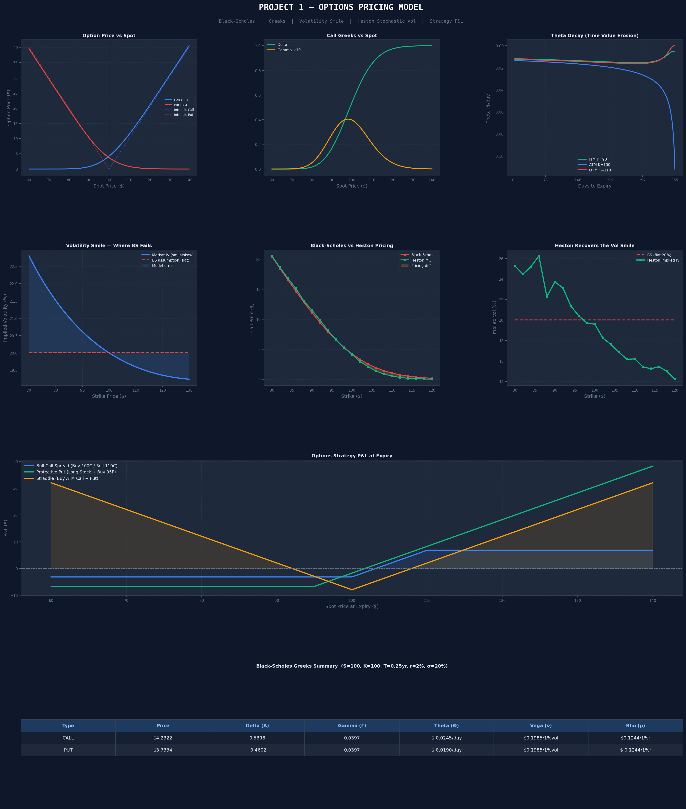

# Options Pricing Model — Black-Scholes, Greeks & Heston

A from-scratch implementation of options pricing theory in Python, covering Black-Scholes, all 5 Greeks, the volatility smile problem, and the Heston Stochastic Volatility Model as a fix.

---

## What This Project Does

| Component | Description |
|---|---|
| Black-Scholes | Prices calls and puts from first principles |
| Greeks | Delta, Gamma, Theta, Vega, Rho — all computed analytically |
| Implied Volatility | Recovered from market prices via Brent's root-finding method |
| Volatility Smile | Demonstrates where Black-Scholes fails |
| Heston Model | Monte Carlo simulation with stochastic volatility — fixes the smile |
| Strategy P&L | Bull Call Spread, Protective Put, Straddle payoff diagrams |

---

## Tearsheet



---

## Key Results

```
Black-Scholes (S=100, K=100, T=0.25yr, r=2%, σ=20%):
  Call Price:  $4.2322
  Put Price:   $3.7334
  Put-Call Parity check: 0.000000 ✅ (should be ~0)

Call Greeks:
  Delta (Δ):   0.540    ← price moves $0.54 per $1 move in spot
  Gamma (Γ):   0.040    ← Delta changes by 0.040 per $1 move
  Theta (Θ):  -$0.025   ← loses $0.025 of value per day
  Vega  (ν):   $0.199   ← gains $0.199 per 1% increase in vol
```

---

## The Volatility Smile — Where Black-Scholes Breaks

Black-Scholes assumes **constant volatility** across all strikes. Real markets don't.

Out-of-the-money puts (disaster insurance) are **more expensive** than BS predicts because:
- Markets crash suddenly (fat tails)
- Investors pay a premium for downside protection
- Volatility itself is not constant — it jumps around

The **Heston Model** fixes this by letting volatility follow its own random process.

```
Heston parameters:
  v0      = 0.04    (initial variance)
  kappa   = 2.0     (mean-reversion speed of variance)
  theta   = 0.04    (long-run variance)
  xi      = 0.5     (vol of vol)
  rho     = -0.7    (correlation: negative = left skew, realistic)
```

---

## How to Run

```bash
pip install numpy pandas scipy matplotlib
python options_pricing_model.py
```

Output: `tearsheet_options_pricing_model.png` with 8 charts including pricing curves, Greeks, vol smile, Heston comparison, and strategy P&L.

---

## Concepts Explained

| Term | Plain English |
|---|---|
| **Call option** | Right to BUY at a fixed price |
| **Put option** | Right to SELL at a fixed price |
| **Strike (K)** | The fixed price in your contract |
| **Implied Vol** | The market's expectation of future volatility, backed out of option prices |
| **Vol smile** | IV is higher for OTM options than ATM — looks like a smile on a chart |
| **Heston model** | Prices options assuming vol itself is random (more realistic) |
| **Monte Carlo** | Simulate thousands of random price paths, average the payoffs |

---

## Limitations

- Heston is calibrated with example parameters, not fitted to real option chains
- No dividend adjustment
- European options only (no early exercise)
- Monte Carlo has sampling error (~SE reported per price)

---

## Tech Stack

`numpy` · `scipy` · `matplotlib`
